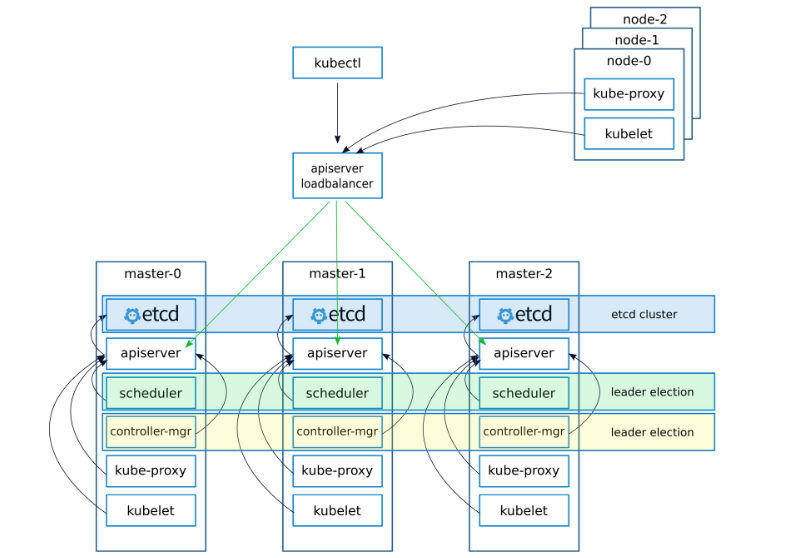

# Kubernetes Cluster Components
[Provisioning Kubernetes Clusters](https://rancher.com/docs/rancher/v2.x/en/cluster-provisioning/)  
Kubernetes classifies nodes into three types:
- etcd Nodes
etcd nodes run the etcd database. 3, 5,or 7 nodes are recommended for redundancy.
- Control Plane Nodes
Control plane nodes run the Kubernetes API server, scheduler, and controller manager. In comparision with etc nodes, it is stateless and also two or more nodes are recommended for redundancy. 
- Worker Nodes
Worker nodes run `kubelet`, `kubeproxy`, `Workloads`(The containers and pods that hold your apps).

Worker nodes also run storage and networking drivers, and ingress controllers when required. 

# Kubernetes Objects  
Kubernetes Objects are `persistent entities` in the Kubernetes system.

Required Fields:
- apiVersion  
Which version of the Kubernetes API you’re using to create this object

- kind  
What kind of object you want to create, such as some conventional kinds `deployment`, `service`. It's case-insentive and name-arbitrary.

- metadata  
Data that helps uniquely identify the object, including a name string, UID, and optional namespace

[Understanding Kubernetes Objects](https://kubernetes.io/docs/concepts/overview/working-with-objects/kubernetes-objects/#required-fields)

# Kubernetes Volume

- emptyDir  
An emptyDir volume is first created when a Pod is assigned to a Node, and exists as long as that Pod is running on that node.  

- hostPath  
A hostPath volume mounts a file or directory from the host node’s filesystem into your Pod. This is not something that most Pods will need, but it offers a powerful escape hatch for some applications.  

# Kubernetes Cluster Architecture
- Xtensio-Kubernetes-HA-Setup

- Rancher

