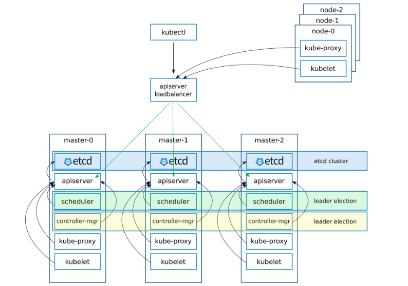

# Get Started with Minikube  
Minikube can be installed locally and runs a simple, single-node Kubernetes cluster inside a virtual machine(VM).

## kubectl  
[kubectl Cheat Sheet](https://kubernetes.io/docs/reference/kubectl/cheatsheet/)


### Install  
```sh
curl -LO https://storage.googleapis.com/kubernetes-release/release/$(curl -s https://storage.googleapis.com/kubernetes-release/release/stable.txt)/bin/linux/amd64/kubectl
chmod +x ./kubectl
sudo mv ./kubectl /usr/local/bin/kubectl
```

### Configure  
To find and access a Kubernetes cluster, it needs a kubeconfig file, which is often created automatically when you deploy a Kubernetes cluster such as a Minikube cluster. By default, kubectl configuration is located at `~/.kube/config`.

To access a existed Kubernetes cluster, 
see [Kubernetes Cluster Access](https://kubernetes.io/docs/tasks/access-application-cluster/configure-access-multiple-clusters/) in detail.

For instance, configure the aws Kubernates cluster enabled.  

1. `cd` in your `config-exercise` directory, create a file named `config-aws` with proper content.  

2. Temporarily append this path to `KUBECONFIG` env variable.  
  ```sh
  export KUBECONFIG=$KUBECONFIG:config-aws
  ```

3. Switch current context into aws context.  
  ```sh
  $ kubectl config view
  $ kubectl config view --minify
  $ kubectl config get-contexts
  $ kubectl config use-context msa.k8s.local
  ```

4. Check connection with cluster.  
  ```sh
  $ kubectl cluster-info
  $ kubectl cluster-info dump
  ```
5. Start kube proxy.  
  ```sh
  $ kubectl proxy
  Starting to serve on 127.0.0.1:8001

  ```

  Browse `http://localhost:8001/api/v1/namespaces/kube-system/services/` instead of `https://18.232.115.164:6443/api/v1/namespaces/kube-system/services/`.  
  For more `API` endpoints, seeing [Kube API](#Kube API)  


### Enabling shell autocompletion  
Permantly add kubectl autocompletion.  

```sh
echo "source <(kubectl completion bash)" >> ~/.bashrc
```


## Minikube  

### Install  
```sh
curl -Lo minikube https://storage.googleapis.com/minikube/releases/v0.27.0/minikube-linux-amd64 && chmod +x minikube && sudo mv minikube /usr/local/bin/
```

### Configure  
```sh
export MINIKUBE_HOME=$HOME
export CHANGE_MINIKUBE_NONE_USER=true
mkdir $HOME/.kube || true
touch $HOME/.kube/config

export KUBECONFIG=$HOME/.kube/config
```

### Enabling shell autocompletion  

Permantly add minikube autocompletion.  

```sh
echo "source <(minikube completion bash)" >> ~/.bashrc
```

### Run without VM support  

```sh
sudo minikube start --vm-driver=none
kubectl run hello-minikube --image=k8s.gcr.io/echoserver:1.10 --port=8080
kubectl expose deployment hello-minikube --type=NodePort
kubectl get pod
# We can see that the pod is now Running and we will now be able to curl it:
curl $(minikube service hello-minikube --url)
kubectl delete services hello-minikube
kubectl delete deployment hello-minikube
minikube stop
```


# Kubernetes  

## Pod  
[kubernetes pause container](https://www.ianlewis.org/en/almighty-pause-container)  
[linux process namespace](https://unix.stackexchange.com/questions/113530/how-to-find-out-namespace-of-a-particular-process)  
[linux namespace](https://prefetch.net/blog/2018/02/22/making-sense-of-linux-namespaces/)  
[get parent PID of a given child's process ID](https://askubuntu.com/questions/153976/how-do-i-get-the-parent-process-id-of-a-given-child-process)  

## Controller  

## Service    
[kubernetes service network](https://kubernetes.io/docs/tutorials/services/source-ip/)  
[kubectl commands and docker-cli commands](https://kubernetes.io/docs/reference/kubectl/docker-cli-to-kubectl/)  
[kubernetes service](https://kubernetes.io/docs/concepts/services-networking/service/)  
[how kubernetes networking services work](https://medium.com/google-cloud/understanding-kubernetes-networking-services-f0cb48e4cc82)  
[Kubernetes NodePort vs LoadBalancer vs Ingress? When should I use what?](https://medium.com/google-cloud/kubernetes-nodeport-vs-loadbalancer-vs-ingress-when-should-i-use-what-922f010849e0)  

### NodePort  
[Get Node and NodePort](https://kubernetes.io/docs/tutorials/services/source-ip/)  

### Ingress  
Prior to enable the ingress, it need to deploy [a NGINX Ingress Controller](https://kubernetes.github.io/ingress-nginx/deploy/) as pod.

```sh
kubectl apply -f https://raw.githubusercontent.com/kubernetes/ingress-nginx/master/deploy/mandatory.yaml
```

[NGINX Ingress Controller
](https://github.com/kubernetes/ingress-nginx)  
[Dynamic Ingress in Kubernetes - Kubernetes](https://kubernetes.io/blog/2018/06/07/dynamic-ingress-in-kubernetes/)  
[MetalLB, bare metal load-balancer for Kubernetes](https://metallb.universe.tf/community/)  
[google/metallb: A network load-balancer implementation for Kubernetes using standard routing protocols](https://github.com/google/metallb)  
[MetalLB: a load balancer for bare metal Kubernetes clusters | IT Svit Blog](https://itsvit.com/blog/metallb-load-balancer-bare-metal-kubernetes-clusters/)  
[Kubernetes - Træfik](https://docs.traefik.io/user-guide/kubernetes/)  
[Kubernetes Ingress - Træfik](https://docs.traefik.io/configuration/backends/kubernetes/)  
[Kubernetes-native microservices API gateway: Ambassador](https://www.getambassador.io/)  

## Security  
Get dashboard token to login
```sh
kubectl -n kube-system get secret
kubectl -n kube-system describe secret dashboard-token-55gs8
```


## Kube API  
[Kubernetes API Concepts](https://kubernetes.io/docs/reference/using-api/api-concepts/)  

# Kubernetes Management Platform
[Right Solution for Kubernetes](https://kubernetes.io/docs/setup/pick-right-solution/)  


## Kubernetes Cluster
[Provisioning Kubernetes Clusters](https://rancher.com/docs/rancher/v2.x/en/cluster-provisioning/)  
Kubernetes classifies nodes into three types:
- etcd Nodes
etcd nodes run the etcd database. 3, 5,or 7 nodes are recommended for redundancy.
- Control Plane Nodes
Control plane nodes run the Kubernetes API server, scheduler, and controller manager. In comparision with etc nodes, it is stateless and also two or more nodes are recommended for redundancy. 
- Worker Nodes
Worker nodes run `kubelet`, `kubeproxy`, `Workloads`(The containers and pods that hold your apps).

Worker nodes also run storage and networking drivers, and ingress controllers when required. 

### Bootstrap Cluster with kubeadmin

[Creating Highly Available Clusters with kubeadm](https://kubernetes.io/docs/setup/independent/high-availability/)  
[Setting up highly available Kubernetes clusters](https://elastisys.com/wp-content/uploads/2018/01/kubernetes-ha-setup.pdf?x83281)  
  


### On-Premises turnkey cloud solutions
Allow you to create Kubernetes clusters on your own internal, secure, cloud network with only a few commands


#### Kontena Pharos

[Kontena Pharos – The simple, solid, certified Kubernetes distribution that just works.](https://www.kontena.io/pharos/)
[Introduction · Kontena Pharos](https://pharos.sh/docs/)
[Kontena Pharos 2.1 Released](https://blog.kontena.io/kontena-pharos-2-1-released/)
[Kubernetes That Just Works: Kontena Pharos 2.0 Released](https://blog.kontena.io/kubernetes-that-just-works-kontena-pharos-2-0-released/)
[Kontena Pharos 1.3.0](https://blog.kontena.io/kontena-pharos-1-3-0/)
[Kontena Pharos 1.0 Released: Control the Raw Power of Kubernetes](https://blog.kontena.io/kontena-pharos-1-0-released/)


#### Rancher/RKE  
[Architecture](https://rancher.com/docs/rancher/v2.x/en/overview/architecture/)  
   

### Prerequiremnt  
[All Nodes](https://rancher.com/docs/rancher/v2.x/en/installation/requirements/) must be installed with `docker` and comply with [Port Requirements](https://rancher.com/docs/rancher/v2.x/en/installation/references/#kubernetes-cluster-nodes)  

[docker for ubuntu](https://docs.docker.com/install/linux/docker-ce/ubuntu/)  

> see `rancher.md`

[Quick Start Guide | Rancher Labs](https://rancher.com/docs/rancher/v2.x/en/quick-start-guide/)
[An Introduction to Rancher Kubernetes Engine (RKE) | Rancher Labs](https://rancher.com/an-introduction-to-rke/)
[How to Deploy Kubernetes Clusters on AWS using RKE | Rancher Labs](https://rancher.com/blog/2018/2018-05-14-rke-on-aws/)

### [Manual Installation](https://rancher.com/docs/rancher/v2.x/en/quick-start-guide/deployment/quickstart-manual-setup/)  
Here some notices,
1. Install `rancher` on the a single host.  
  Assure that all the nodes in the further `kubernetes` cluster are able to reach the host and required ports such as `443`, etc.

  ```sh
  $ sudo docker run -d --restart=unless-stopped -p 80:80 -p 443:443 rancher/rancher
  ```

2. Add node into `kubernetes` cluster  

  Add a node with role `etcd`, `controlplane`, and `worker`, which serves as [Master Components](https://kubernetes.io/docs/concepts/overview/components/#master-components) in the cluster. 
  ```sh
  sudo docker run -d --privileged --restart=unless-stopped --net=host -v /etc/kubernetes:/etc/kubernetes -v /var/run:/var/run rancher/rancher-agent:v2.1.5 --server https://34.207.217.242 --token dlqkcc6wtl5kg7vmvwqfpht86bxfpl7bfq65qjsssshcwdqcw2l7fp --ca-checksum a84ee00b8dc39725b2bee52e86070eb7d1f7ecc05e1aebf9b23b62658721d0ff --etcd --controlplane --worker
  ```


  Add a node with role `worker`, which serves as [Node Components](https://kubernetes.io/docs/concepts/overview/components/#node-components) in the cluster. 
  ```sh
  sudo docker run -d --privileged --restart=unless-stopped --net=host -v /etc/kubernetes:/etc/kubernetes -v /var/run:/var/run rancher/rancher-agent:v2.1.5 --server https://34.207.217.242 --token dlqkcc6wtl5kg7vmvwqfpht86bxfpl7bfq65qjsssshcwdqcw2l7fp --ca-checksum a84ee00b8dc39725b2bee52e86070eb7d1f7ecc05e1aebf9b23b62658721d0ff --worker
  ```


#### Problem  
kube dns
```sh
> kubectl get service -n kube-system kube-dns
NAME       TYPE        CLUSTER-IP   EXTERNAL-IP   PORT(S)         AGE
kube-dns   ClusterIP   10.43.0.10   <none>        53/UDP,53/TCP   5d
```

kube proxy
```sh
ubuntu@ip-10-0-2-22:~$ ps auxw | grep kube-proxy
ubuntu    7612  0.0  0.0  12916  1020 pts/0    S+   09:41   0:00 grep --color=auto kube-proxy
root     14190  0.3  2.0 529924 81320 ?        Ssl  Jan28   6:54 kube-proxy --healthz-bind-address=0.0.0.0 --cluster-cidr=10.42.0.0/16 --hostname-override=ip-10-0-2-22 --kubeconfig=/etc/kubernetes/ssl/kubecfg-kube-proxy.yaml --v=2
```

When there are two or more nodes in Rancher control, the pods across the cluster cannot communicate with each other within different nodes while only having communication with pods in the same node.

Let's take an occurrence. `checker` pods are in `10.0.2.158` and `10.0.2.22` nodes, and `redis` pod is in `10.0.2.22` node.
```sh
> kubectl get pods -o wide
NAME                           READY     STATUS    RESTARTS   AGE       IP            NODE
cheker-7bbf97f9fd-b5bjg        1/1       Running   0          20h       10.42.1.61    ip-10-0-2-22
cheker-7bbf97f9fd-xvqwp        1/1       Running   0          3h        10.42.0.104   ip-10-0-2-158
db-55859f476b-kwpbh            1/1       Running   0          19h       10.42.1.65    ip-10-0-2-22
hello-world-5d7c44bfb7-k6xdx   1/1       Running   0          20h       10.42.0.83    ip-10-0-2-158
redis-cf8cd8d45-4ktld          1/1       Running   0          20h       10.42.1.62    ip-10-0-2-22
```

`ip-10-0-2-22` node,
```sh
pod@cheker-7bbf97f9fd-b5bjg:/# nslookup redis
Server:         10.43.0.10
Address:        10.43.0.10#53

Name:   redis.vote.svc.cluster.local
Address: 10.42.1.62

# Ping redis ip 10.42.1.62
pod@cheker-7bbf97f9fd-b5bjg:/# ping 10.42.1.62
PING redis.vote.svc.cluster.local (10.42.1.62) 56(84) bytes of data.
64 bytes from ip-10-42-1-62.ec2.internal (10.42.1.62): icmp_seq=1 ttl=63 time=0.069 ms
64 bytes from ip-10-42-1-62.ec2.internal (10.42.1.62): icmp_seq=2 ttl=63 time=0.051 ms
64 bytes from ip-10-42-1-62.ec2.internal (10.42.1.62): icmp_seq=3 ttl=63 time=0.059 ms

# Ping hello-world ip 10.42.0.83
pod@cheker-7bbf97f9fd-b5bjg:/# ping 10.42.0.83
PING 10.42.0.83 (10.42.0.83) 56(84) bytes of data.
^C

# Ping google.com(172.217.5.238)
pod@cheker-7bbf97f9fd-b5bjg:/# ping google.com
PING google.com (172.217.5.238) 56(84) bytes of data.
64 bytes from iad30s07-in-f14.1e100.net (172.217.5.238): icmp_seq=1 ttl=47 time=1.15 ms

pod@cheker-7bbf97f9fd-b5bjg:/# nslookup google.com
Server:         10.43.0.10
Address:        10.43.0.10#53

Non-authoritative answer:
Name:   google.com
Address: 172.217.7.142


```


`ip-10-0-2-158` node,
```sh
pod@cheker-7bbf97f9fd-xvqwp:/# nslookup redis
^C
root@cheker-7bbf97f9fd-xvqwp:/# cat /etc/resolv.conf
nameserver 10.43.0.10
search vote.svc.cluster.local svc.cluster.local cluster.local ec2.internal
options ndots:5

# Ping redis ip 10.42.1.62
pod@cheker-7bbf97f9fd-xvqwp:/# ping 10.42.1.62
^C

# Ping hello-world ip 10.42.0.83
pod@cheker-7bbf97f9fd-xvqwp:/# ping 10.42.0.83
PING 10.42.0.83 (10.42.0.83) 56(84) bytes of data.
64 bytes from 10.42.0.83: icmp_seq=1 ttl=63 time=0.071 ms

# Ping google.com(172.217.5.238)
pod@cheker-7bbf97f9fd-xvqwp:/# ping google.com
^C
pod@cheker-7bbf97f9fd-xvqwp:/# nslookup google.com
^C
pod@cheker-7bbf97f9fd-xvqwp:/# ping 172.217.5.238
PING 172.217.5.238 (172.217.5.238) 56(84) bytes of data.
64 bytes from 172.217.5.238: icmp_seq=1 ttl=47 time=1.31 ms

```
It indicates,
Pod `checker` in `ip-10-0-2-158` cannot connect the dns server and also cannot ping `redis` pod in `ip-10-0-2-22`. It can ping `hello-world` pod in ``ip-10-0-2-158`.
Pod `checker` in `ip-10-0-2-22` can ping `redis` pod in `ip-10-0-2-22` but cannot ping `hello-world` pod in ``ip-10-0-2-158`.


Connection between `ip-10-0-2-158` and `ip-10-0-2-22`.
```sh
ubuntu@ip-10-0-2-158:~$ ping 10.0.2.22
PING 10.0.2.22 (10.0.2.22) 56(84) bytes of data.
64 bytes from 10.0.2.22: icmp_seq=1 ttl=64 time=15.7 ms
64 bytes from 10.0.2.22: icmp_seq=2 ttl=64 time=0.421 ms

```


#### Possible Solution
In AWS cluster, make sure that all nodes in the cluster are conform to the [Kubenets Port Requirement](https://rancher.com/docs/rancher/v2.x/en/installation/references/#kubernetes-cluster-nodes), especially the UDP. In this case, I work out the problem by add `All UDP` security group in AWS.

[AWS Security Group In Cluster](https://docs.aws.amazon.com/eks/latest/userguide/sec-group-reqs.html)  


# Docker Project Example
[voting app](https://github.com/dockersamples/example-voting-app/)  
```sh
git clone https://github.com/dockersamples/example-voting-app.git
cd example-voting-app/worker/
docker build -f Dockerfile.j -t dockersamples/examplevotingapp_worker_java .
```


# References
[minikube](https://github.com/kubernetes/minikube/blob/v0.27.0/README.md)  
[kubernetes debug approaches](https://kubernetes.io/docs/tasks/debug-application-cluster/debug-service/)  
[What is etcd?](https://thenewstack.io/about-etcd-the-distributed-key-value-store-used-for-kubernetes-googles-cluster-container-manager/) 
[Consensus Algorithm: Raft](https://raft.github.io/)  

# Troubleshooting
[Kubenetes Debug](https://kubernetes.io/docs/tasks/debug-application-cluster/debug-service/)  

# Help CLI
```sh
sudo iptables-save | grep frontend
kubectl delete --all deployment --namespace=ingress-nginx
```

```sh
#a user with passwordless sudo permission
echo "$USER ALL=(ALL) NOPASSWD:ALL" | sudo tee /etc/sudoers.d/$USER
```

- Completely remove and clean Kubernetes
```sh
kubeadm reset
sudo apt-get purge kubeadm kubectl kubelet kubernetes-cni kube*   
sudo apt-get autoremove
sudo rm -rf ~/.kube
```

- Stop and remove all Docker containers
```sh
docker container stop $(docker container ls -aq)
docker container rm -f  $(docker container ls -aq)
docker container prune -f
```

- Manage Docker as a non-root user
```sh
# Add the docker group if it doesn't already exist
sudo groupadd docker
# Add the connected user "$USER" to the docker group
sudo gpasswd -a $USER docker
```

- Get a Shell into Container Controlled by Kubenetes Pod.
```sh
# By docker
docker ps
# Choose the none POD container
docker exec -it efbe165858c0 /bin/sh

# By Kubebertes
kubectl get pod shell-demo
kubectl exec -it shell-demo -- /bin/bash
```

- Switch Namespace
```sh
kubectl config set-context $(kubectl config current-context) --namespace=vote
```

- Log
```sh
kubectl logs <pod or service or deployment name>
# See which labels are available to you
kubectl get pod <one of your pods> -o template --template='{{.metadata.labels}'

kubectl logs --selector app=yourappname
kubectl logs --selector app=yourappname --container yourcontainername
```

- Kubenetes Network Troubleshoot
check the connectivity between containers.
```sh
# Docker image with tools like curl, wget, ping, nslookup, dig, psql, mysql etc.
kubectl run --rm utils -it --image arunvelsriram/utils bash

ip route get 10.4.1.1

# You will be seeing a bash prompt
redis-cli -h redis
psql -h db -U postgres
```